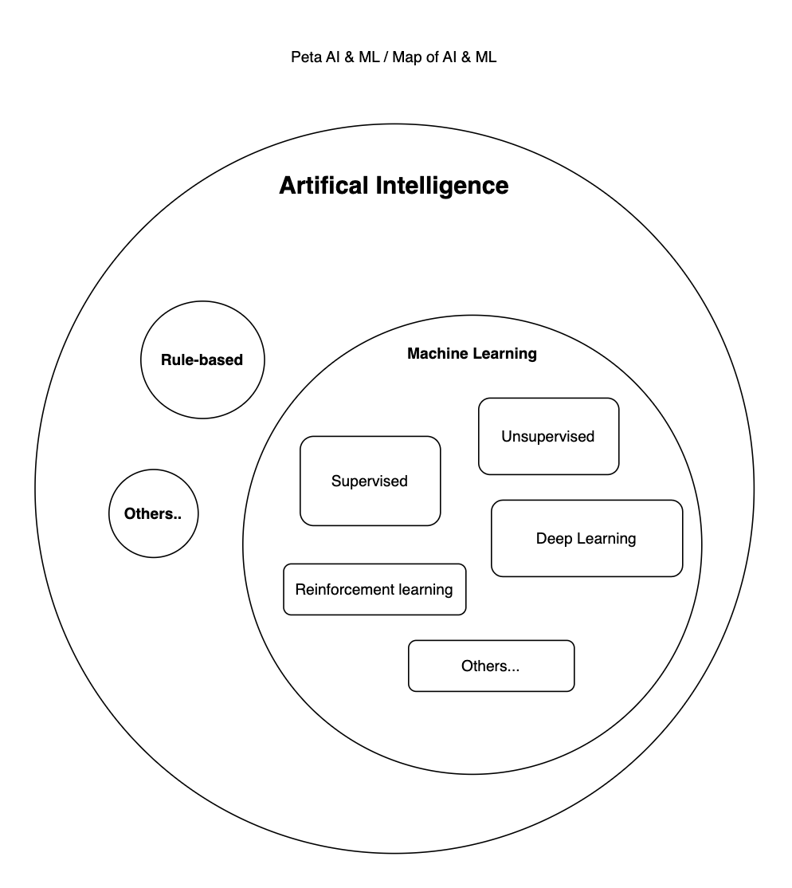

# Understanding AI & Machine Learning in Game Dev – written by a newbie dev
## What's AI & ML

Keep in mind that when we are talking their capabilities is like how we (human) think and communicating with ourself. AI represents our behaviour in every action we did in our daily-basis. Machine Learning is a sub-set of AI concept that developed to teach machine how to **process specific task and give the accurate results as we want**.
In the making, we need to feed them (AI & ML) flow/data/pattern since we want to get specific results.

## Map of AI & ML

There are several popular approaches of AI & ML that help us now. In the *figure 1*, we see the AI is the parent of ML and Rule-based. 

figure 1, Map of AI & Machine Learnings

- **Rule-based** is an traditional AI approach used in several technologies, for an instance: Chat Bot, Email Spam Filtering, etc. A **rule-based** system must be supplied with a pattern in order to achieve what we want.
  
  Take an example of Chat Bot, if we have a bussiness and we want to sell our products, we need to collect the details from our customer such as: which product that they choose, payment method, name, address, etc. Using Chat Bot is a good solution. Consumer won't be asked stressful questions, you won't face unformatted answers, and it can be converted a well-detailed order format as your consumer have done the process.

  A **rule-based** system would determine what's next action/event that fired by the client through translating the action/event with predefined conditional case that you have already setup. This done by only using your custom flow, there's no special pattern & data that system should learn.

figure 2, taken from myoperator.com

- Unlike **Rule-based** that you need to define the flow completely as well as only some cases that can be handled, **Machine Learning** can handle many recurring tasks and problems. Nowadays, you can ask your phone by speaking to play music for you. In this case, this can be done by ML system that has already trained with: understanding about human behaviour, songs database, etc.

## AI & ML implementation design in Game Dev

In order to integrate our Game with AI, we need to define our goals, pick an AI approach, integrate, and test. But that's not a simple thing. Many AI approach have uniqueness on their way to implement. Here, i'll try to give a simplified design flow about how to implement **Rule-based** and **Machine learning**:

1. **Rule-base with Fuzzy Logic**
   
   I'll pick a study case which was on my final year project during my undergraduate in CS. The purpose of the study was creating a first-person action game. The enemies in the game can adapt by reactions given from player. Due to lack of defined parameters of the input (only two inputs: Remaining enemy health & Remaining duration of the completed level), I decided to pick Fuzzy Logic (it's because more easy to understand & implement). *Fuzzy logic is an approach that can model a player’s behavior. Fuzzy values range from 0 to 1 for each membership degree. Fuzzy uses verbal language such as “very slow”, “somewhat moderate” and “very fast” to represent the intensity of fuzzy membership degrees*.  [D. S. O. Soedargo and H. Junaedi](https://doi.org/10.34148/teknika.v11i2.468)

   In *figure 3*, I defined my **Rule-base** Fuzzy-Logic goals that the enemy can be more *resistant* on the next game by adding a new base-health. Then, what's happen on the game?. In *figure 4*, you can see that the *fuzzy rules* would generates a new output parameter using Inference.

    <table align="center">
      <tr>
        <td align="center">
          
          
Figure 3: Flow of Fuzzy Logic

        </td>
        <td align="center">
          
          
Figure 4: How Fuzzy Influences the Game

        </td>
      </tr>
    </table>

    Since we need to understand how can the value of inputs converted to *fuzzy rules*, then we have to create a *degree* or classification (*figure 5*) for the input and as well for the output of *resistance* (figure 6). 

    <table align="center">
      <tr>
        <td align="center">
          
          
Figure 5: Degree of HP input

        </td>
        <td align="center">
          
          
Figure 6: Degree of Resistance output

        </td>
        <!-- <td align="center">
          
          
Figure 7: Fuzzy Rules

        </td> -->
      </tr>
    </table>
    
    I'll only take HP input as for our example which we have a remaining HP at 65, then calculate the *degree crisp value* with [fuzzy membership function](https://pro.arcgis.com/en/pro-app/latest/tool-reference/spatial-analyst/how-fuzzy-membership-works.htm), resulting at 0,5 which classified as the degree of Medium (0,5) and High (0,5). 
    
    Let's say, our Duration input is considered as Normal(1), therefore we have two rules (*figure 7*) that meet with our inputs, Rule 5 and Rule 6. Finally we have to use *MIN* method from Medium and Much *resistance* as our output of *fuzzy-rule inferencing*, which are *min(normal,medium)* and *min(normal,much)*, resulting *resistance* at Medium (0.5) and Much (0.5). Keep in mind that the *min* method was used to suits my expectation with the game, so you can use the other methods to get the output.

    <table align="center">
      <tr>
        <td align="center">
          
          
Figure 7: Fuzzy Rules

        </td>
      </tr>
    </table>

    Lastly, to implement a new base-health for the enemy in the next stage/level. We will calculate the previous *resistance* output with [Weighted Average method](https://cse.iitkgp.ac.in/~dsamanta/courses/archive/sca/Archives/Chapter%205%20Defuzzification%20Methods.pdf), which (((0,5 * 0,5) + (0,5 * 0,75)) / (0,5 + 0,75)); 0,625 / 1,25 resulting 0,5. Since it was a game, you can do whatever you want with the output. Let's adjust the new base health with (0,5 * 100) / 2, resulting 25, then we add an additional *resistance* as a base health on the enemy (125)

  1. **Machine Learning with Reinforcement Learning (Unity ML Agents)**

    
    

   