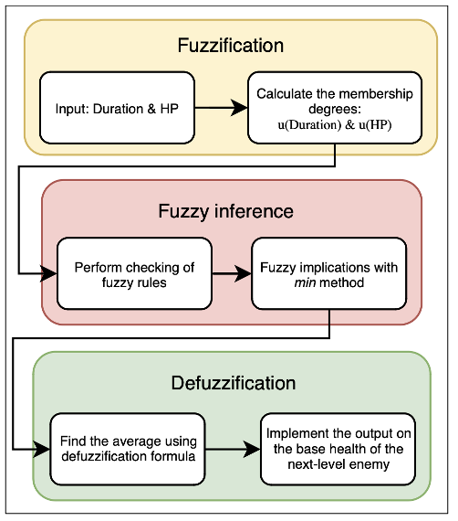
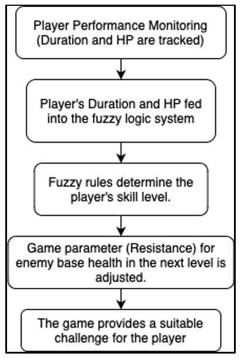
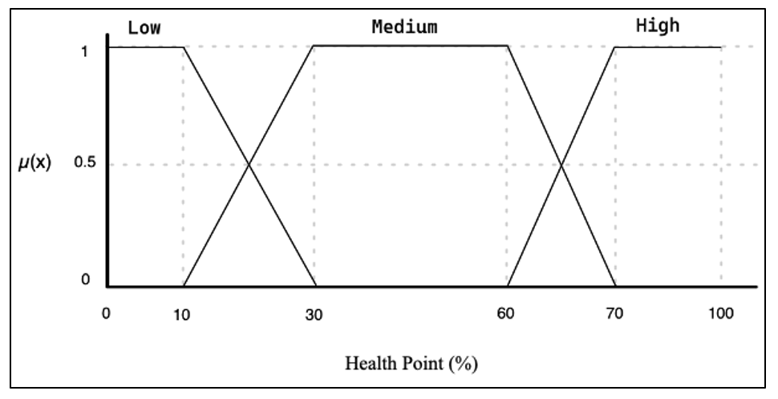
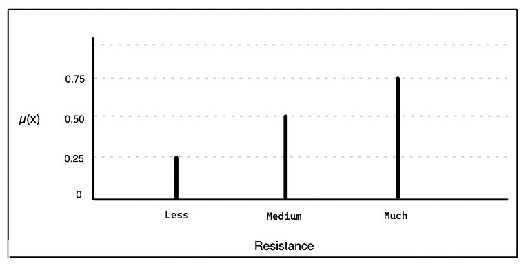
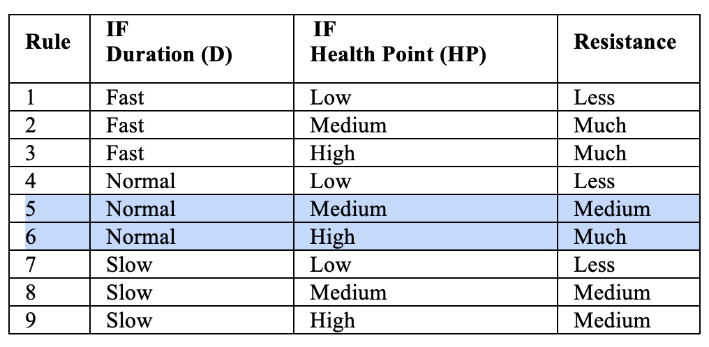
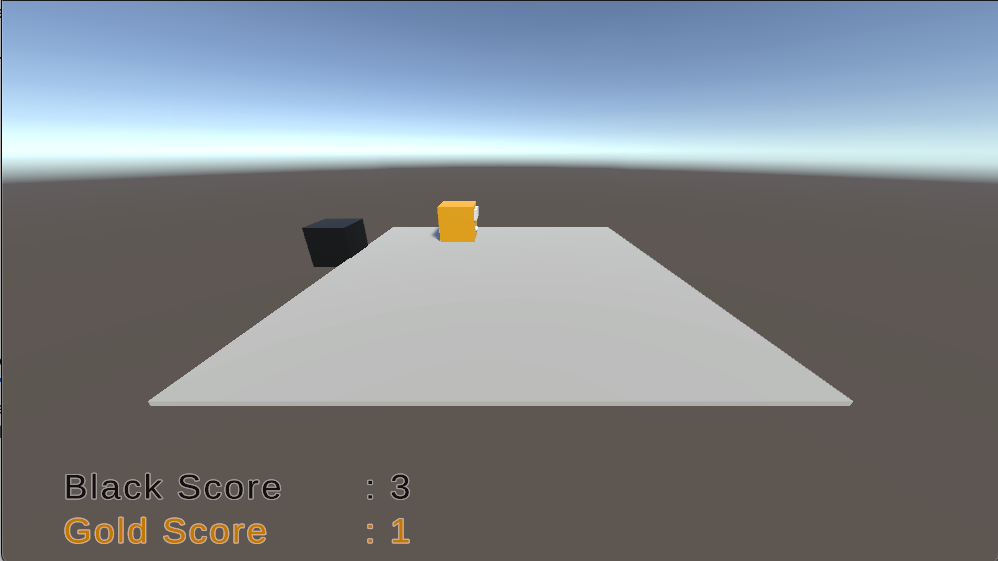
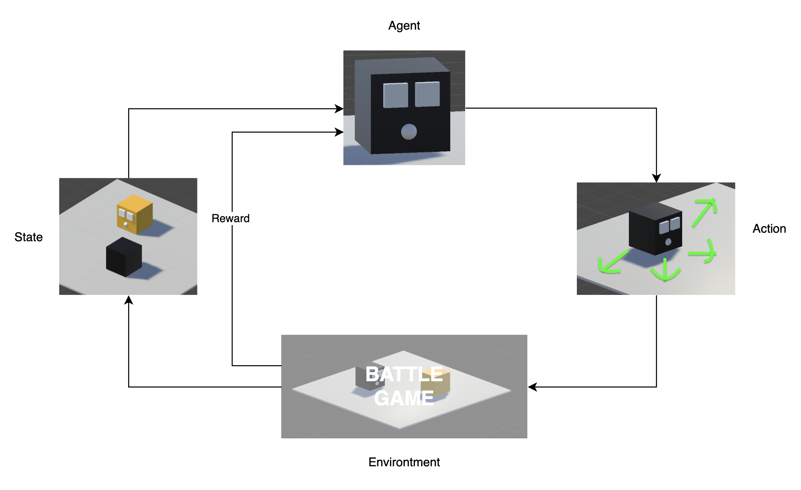

# AI & ML implementation design in Game Dev

In order to integrate our Game with AI, we need to define our goals, pick an AI approach, integrate, and test. But that's not a simple thing. Many AI approach have uniqueness on their way to implement. Here, i'll try to give a simplified design flow about how to implement **Rule-based** and **Machine learning**:

1. **Rule-base with Fuzzy Logic**
   
   I'll pick a study case which was on my final year project during my undergraduate in CS. The purpose of the study was creating a first-person action game. The enemies in the game can adapt by reactions given from player. Due to lack of defined parameters of the input (only two inputs: Remaining enemy health & Remaining duration of the completed level), I decided to pick Fuzzy Logic (it's because more easy to understand & implement). *Fuzzy logic is an approach that can model a player’s behavior. Fuzzy values range from 0 to 1 for each membership degree. Fuzzy uses verbal language such as “very slow”, “somewhat moderate” and “very fast” to represent the intensity of fuzzy membership degrees*.  [D. S. O. Soedargo and H. Junaedi](https://doi.org/10.34148/teknika.v11i2.468)

   In *figure 3*, I defined my **Rule-base** Fuzzy-Logic goals that the enemy can be more *resistant* on the next game by adding a new base-health. Then, what's happen on the game?. In *figure 4*, you can see that the *fuzzy rules* would generates a new output parameter using Inference.

    <table align="center">
      <tr>
        <td align="center">
          
          
Figure 3: Flow of Fuzzy Logic

        </td>
        <td align="center">
          
          
Figure 4: How Fuzzy Influences the Game

        </td>
      </tr>
    </table>

    Since we need to understand how can the value of inputs converted to *fuzzy rules*, then we have to create a *degree* or classification (*figure 5*) for the input and as well for the output of *resistance* (figure 6). 

    <table align="center">
      <tr>
        <td align="center">
          
          
Figure 5: Degree of HP input

        </td>
        <td align="center">
          
          
Figure 6: Degree of Resistance output

        </td>
        <!-- <td align="center">
          
          
Figure 7: Fuzzy Rules

        </td> -->
      </tr>
    </table>
    
    I'll only take HP input as for our example which we have a remaining HP at 65, then calculate the *degree crisp value* with [fuzzy membership function](https://pro.arcgis.com/en/pro-app/latest/tool-reference/spatial-analyst/how-fuzzy-membership-works.htm), resulting at 0,5 which classified as the degree of Medium (0,5) and High (0,5). 
    
    Let's say, our Duration input is considered as Normal(1), therefore we have two rules (*figure 7*) that meet with our inputs, Rule 5 and Rule 6. Finally we have to use *MIN* method from Medium and Much *resistance* as our output of *fuzzy-rule inferencing*, which are *min(normal,medium)* and *min(normal,much)*, resulting *resistance* at Medium (0.5) and Much (0.5). Keep in mind that the *min* method was used to suits my expectation with the game, so you can use the other methods to get the output.

    <table align="center">
      <tr>
        <td align="center">
          
          
Figure 7: Fuzzy Rules

        </td>
      </tr>
    </table>

    Lastly, to implement a new base-health for the enemy in the next stage/level. We will calculate the previous *resistance* output with [Weighted Average method](https://cse.iitkgp.ac.in/~dsamanta/courses/archive/sca/Archives/Chapter%205%20Defuzzification%20Methods.pdf), which (((0,5 * 0,5) + (0,5 * 0,75)) / (0,5 + 0,75)); 0,625 / 1,25 resulting 0,5. Since it was a game, you can do whatever you want with the output. This time let's just adjust the new base health with (0,5 * 100) / 2, resulting 25, then we add it on the base health on the enemy (125).

2. **Reinforcement Learning with Unity ML-Agents**
   
    This is limited to my experience since i was not really into ML in Game Dev, So this article has being polished while im learning in ML. My explanations are depend on a book ["Learn Unity ML-Agents - Fundamentals of Unity Machine Learning" published by PACKT](https://books.google.com/books?hl=en&lr=&id=OMNiDwAAQBAJ&oi=fnd&pg=PP1&dq=Reinforcement+learning+ml+agents+unity&ots=CkEMOw_B70&sig=1PMFOb-CKnrFbtm6g29CI8Cdvm0)
    
    I've tried to build a simple action game shown in *figure 8*. The game contains two players trying to get off each other out of a plane terrain to win the game. One of them is trained with Reinforcement Learning. I named them as **Black** (AI) and **Gold** (player). 
    
    Before we jump in, Unity launched ML-Agents Toolkit in 2017 which is 8 years ago from this article being written. Meaning the development is being enhanced, and more easier for us to try with. ML-Agents Toolkit containing three major components which are Academy, Agent, and Brain. Academy is like teacher that capable to orchestrate decision making of an Agent to collect observations, determining Policy (which is called Brain). 

    <table align="center">
      <tr>
        <td align="center">
          
          
Figure 8: Preview Game

        </td>
      </tr>
    </table>

    For the Reinforcement Learning part in Unity, it will be a loop that an Agent would take an Action based on the State sent by Environtment. 

    <table align="center">
      <tr>
        <td align="center">
          
          
Figure 9: Reinforcement Learning

        </td>
      </tr>
    </table>
    
    Talking in details, the actual process looks like this:

     <table align="center">
      <tr>
        <td align="center">
          
          
Figure 10: RL in Battle Game

        </td>
      </tr>
    </table>

    1). In the first iteration the Agent will receives from State that's initiated by Environtment, then the Agent firing Action to move forward.
    
    2). Second iteration, Environtment enters to a new State, Environtment gift a small Punishment (for not taking too long time) while an Agent takes an Action based on the State
    
    3). Third iteration, Environtment enters to a new State, Environtment gift a Reward (push Gold), and so on until the Gold falls.
    

    The *video 1* below shows that Black player is able to push Gold player until it goes down.

    <table align="center">
      <tr>
        <td align="center">
          <video width="600" height="350" controls>
            <source src="homework_final_result.mp4" type="video/mp4">
          </video>
          
Video 1: Preview Game

        </td>
      </tr>
    </table>

    
    